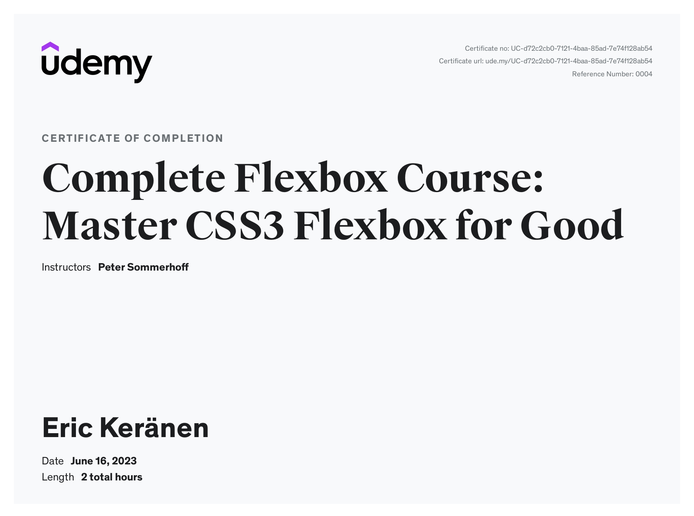

# Complete Flexbox Course: Master CSS3 Flexbox for Good

## Certificate of completion

## What I learned

- Use CSS Flexbox confidently to create modern layouts
- Create web site designs more effectively
- Write high-quality and reusable CSS code
- Vertically align any element
- Take up the remaining space in a container
- Beautiful responsive galleries with Flexbox
- Implement the so-called Holy Grail Layout

## Description

Styling flex containers:

- flex-direction
- justify-content
- align-items
- flex-wrap
- align-content

Then individual flex items:

- order
- align-self
- flex-grow
- flex-shrink
- flex-basis
- flex

And:

- Real-world Flexbox examples to see what kinds of layouts can be achieved:
- Simple grids with Flexbox where all columns in a row have the same size
- More advanced Flexbox grids where columns can have arbitrary sizes
- Vertical centering to vertically align any element
- Media objects, the popular OOCSS pattern
- The Holy Grail Layout, a complete site layout with sidebars and sticky footer