# Flexbox Froggy Answers

'Complete Flexbox Course: Master CSS3 Flexbox for Good' recommands to play a game called flexbox froggy alongside the lectures.

Here I provide my answers to the levels.

You can play flexbox froggy at https://flexboxfroggy.com/

## Level 1

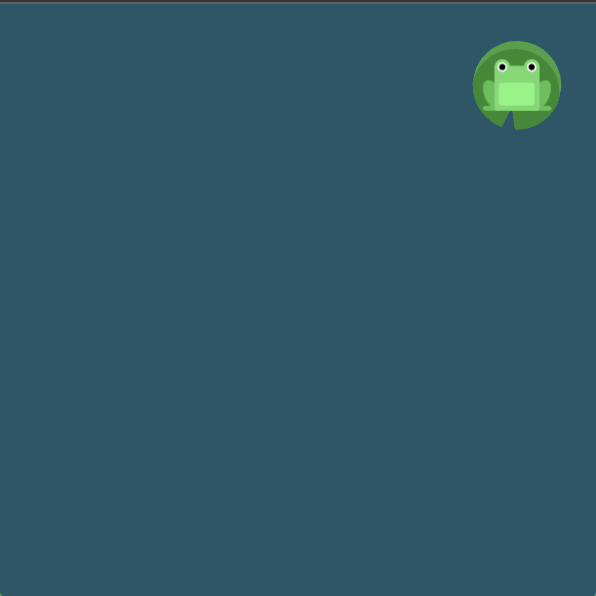

```
#pond {
    display: flex;
    justify-content: flex-end;
}
```

## Level 2

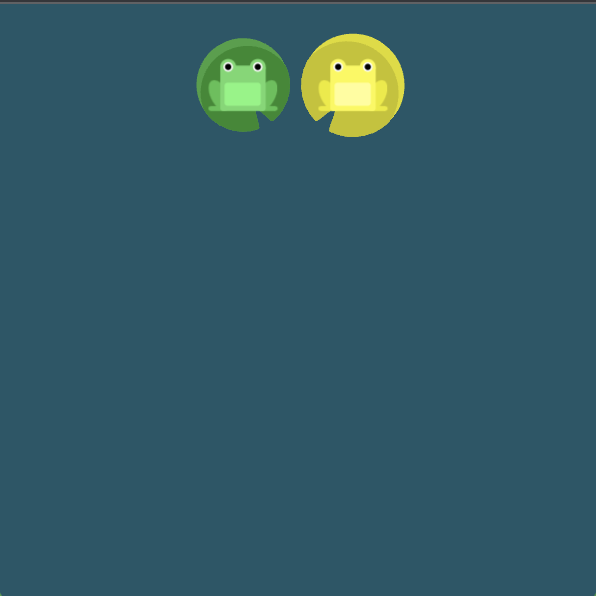

```
#pond {
    display: flex;
    justify-content: center;
}
```

## Level 3

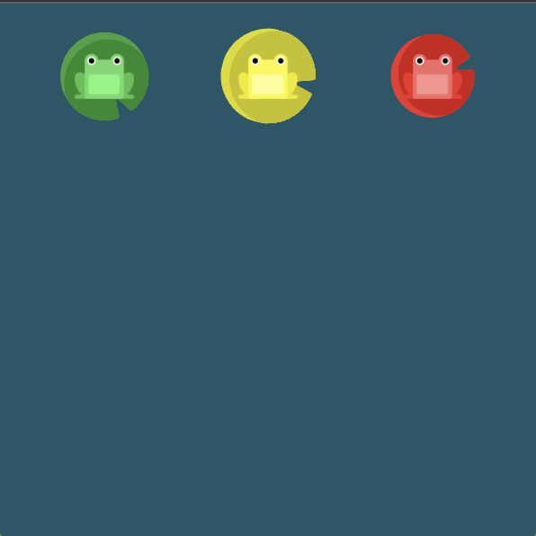

```
#pond {
    display: flex;
    justify-content: space-around;
}
```

## Level 4

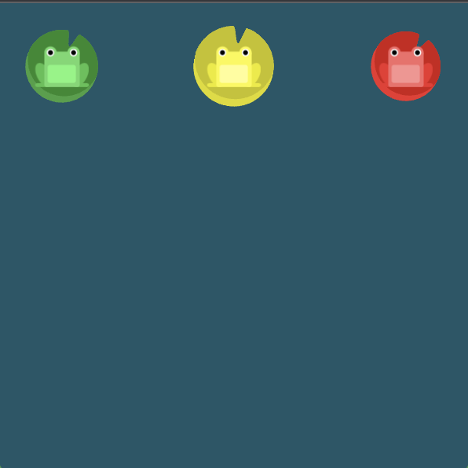

```
#pond {
    display: flex;
    justify-content: space-between;
}
```

## Level 5

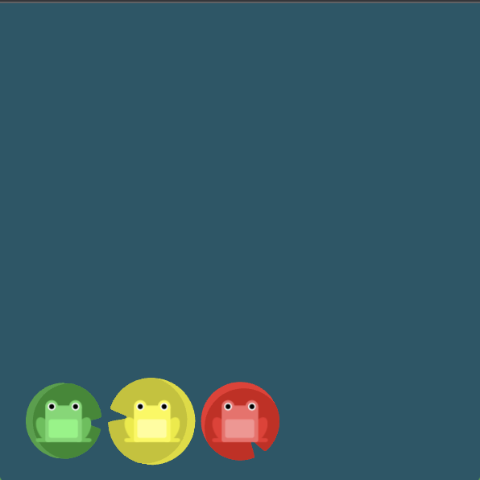

```
#pond {
    display: flex;
    align-items: flex-end;
}
```

## Level 6

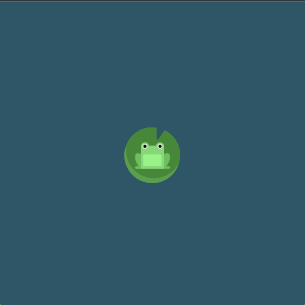

```
#pond {
    display: flex;
    justify-content: center;
    align-items: center;
}
```

## Level 7

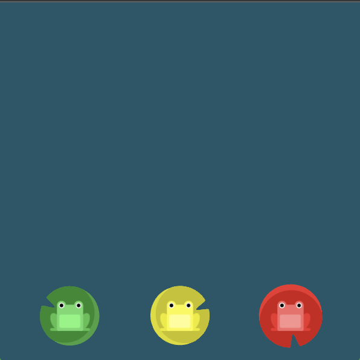

```
#pond {
    display: flex;
    justify-content: space-around;
    align-items: flex-end;
}
```

## Level 8

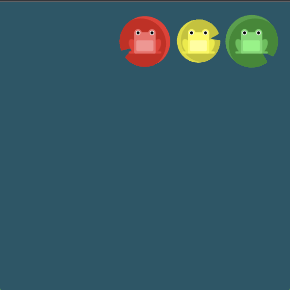

```
#pond {
    display: flex;
    flex-direction: row-reverse;
}
```

## Level 9

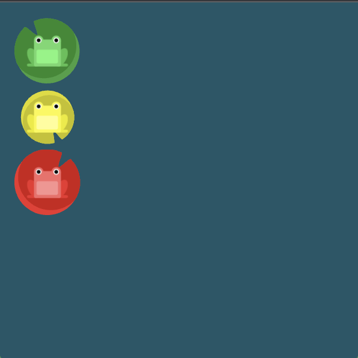

```
#pond {
    display: flex;
    flex-direction: column;
}
```

## Level 10

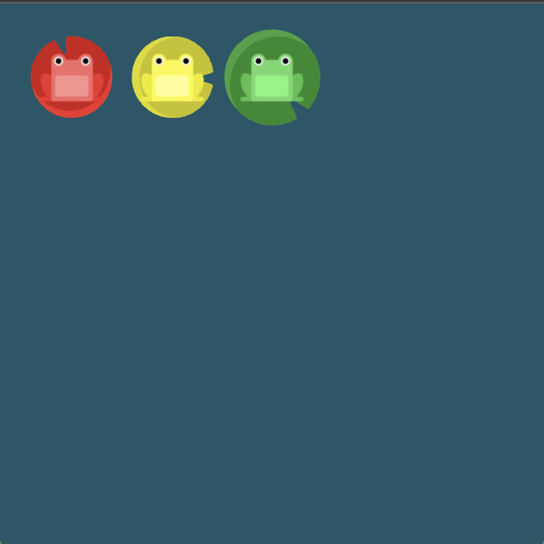

```
#pond {
    display: flex;
    flex-direction: row-reverse;
    justify-content: flex-end;
}
```

## Level 11

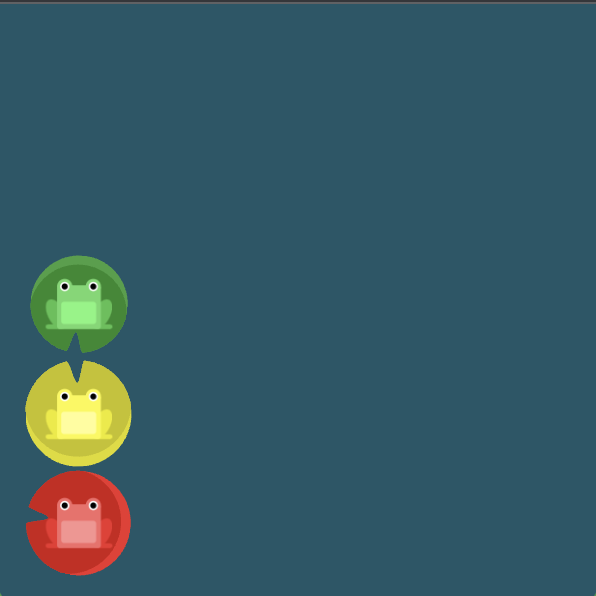

```
#pond {
    display: flex;
    flex-direction: column;
    justify-content: flex-end;
}
```

## Level 12

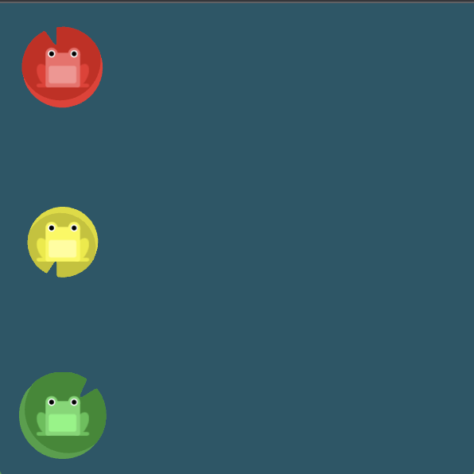

```
#pond {
    display: flex;
    flex-direction: column-reverse;
    justify-content: space-between;
}
```

## Level 13

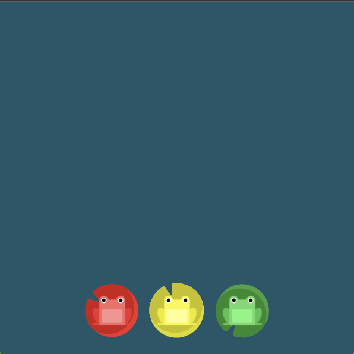

```
#pond {
    display: flex;
    flex-direction: row-reverse;
    justify-content: center;
    align-items: flex-end;
}
```

## Level 14

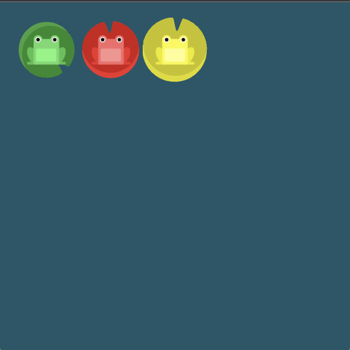

```
#pond {
    display: flex;
}

.yellow {
    order: 1;
}
```

## Level 15

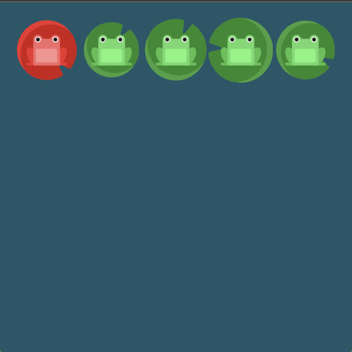

```
#pond {
    display: flex;
}

.red {
    order: -1;
}
```

## Level 16

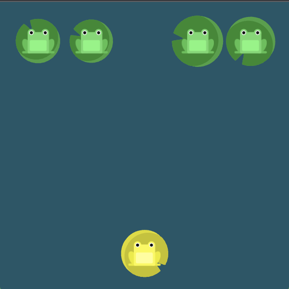

```
#pond {
    display: flex;
    align-items: flex-start;
}

.yellow {
    align-self: flex-end;
}
```

## Level 17

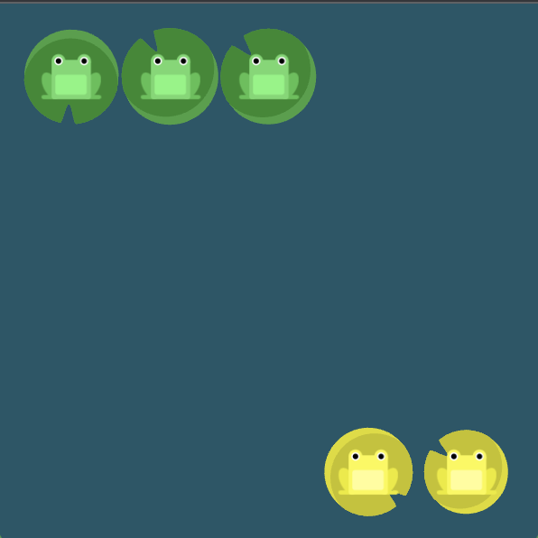

```
#pond {
    display: flex;
    align-items: flex-start;
}

.yellow {
    order: 1;
    align-self: flex-end;
}
```

## Level 18

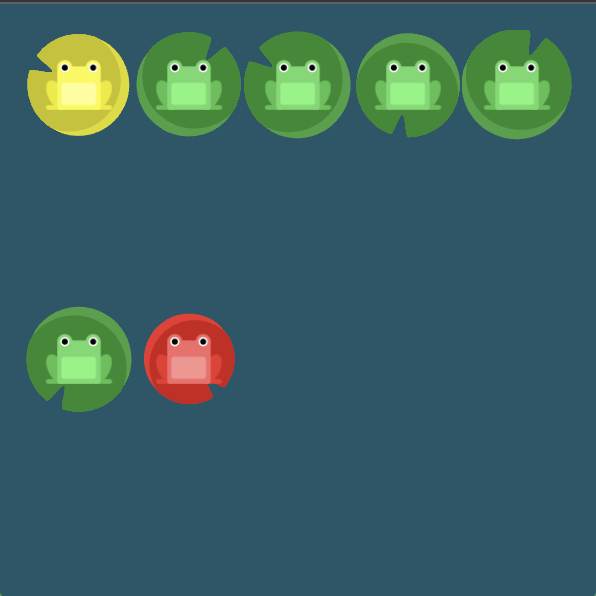

```
#pond {
    display: flex;
    flex-wrap: wrap;
}
```

## Level 19

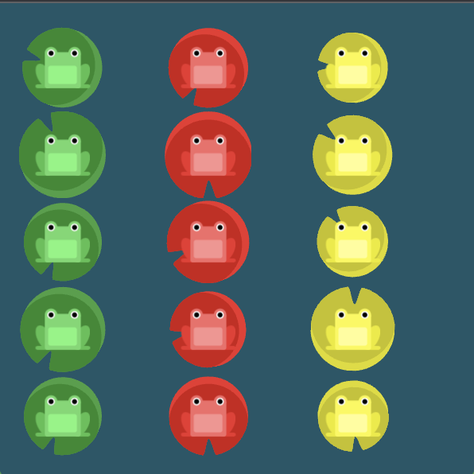

```
#pond {
    display: flex;
    flex-direction: column;
    flex-wrap: wrap;
}
```

## Level 20

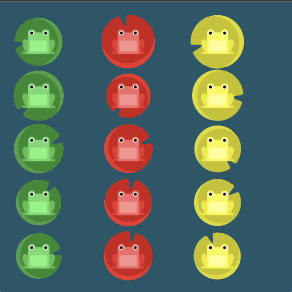

```
#pond {
    display: flex;
    flex-flow: column wrap;
}
```

## Level 21

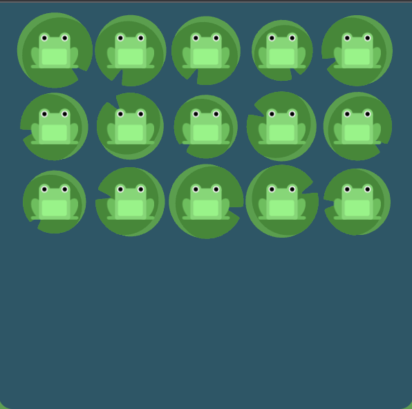

```
#pond {
    display: flex;
    flex-wrap: wrap;
    align-content: flex-start;
}
```

## Level 22

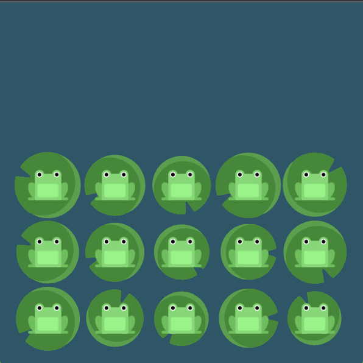

```
#pond {
    display: flex;
    flex-wrap: wrap;
    align-content: flex-end;
}
```

## Level 23

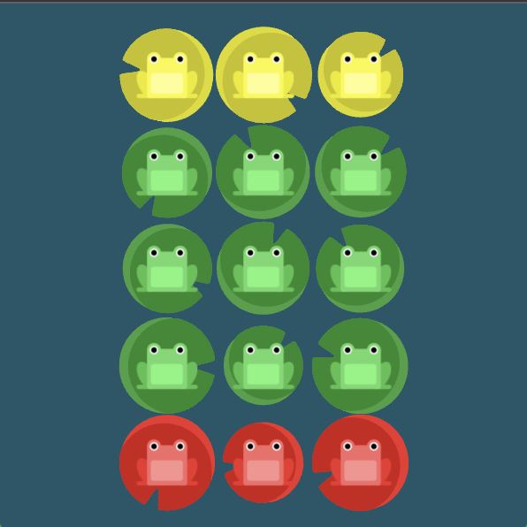

```
#pond {
    display: flex;
    flex-wrap: wrap;
    flex-direction: column-reverse;
    align-content: center;
}
```

## Level 24

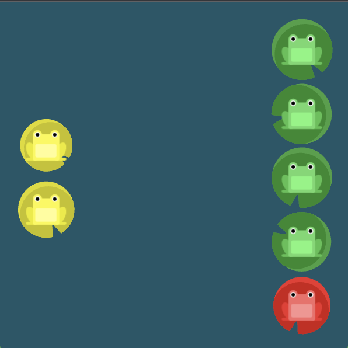

```
#pond {
    display: flex;
    flex-direction: column-reverse;
    flex-wrap: wrap-reverse;
    justify-content: center;
    align-content: space-between;
}
```

### End

That's all ^u^

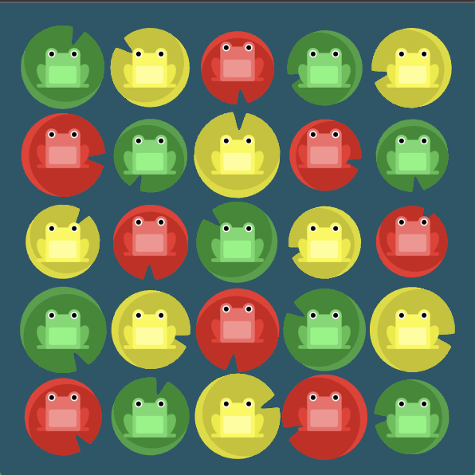